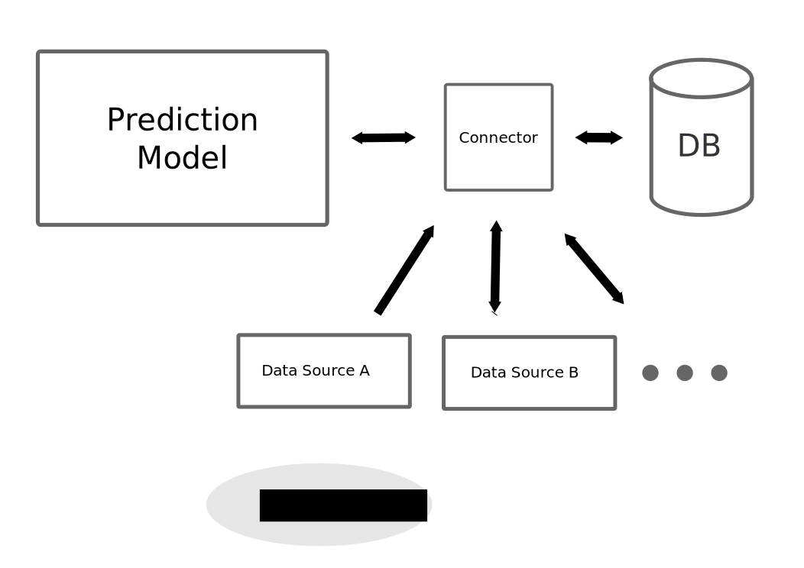

#  iGEM ETH Zurich - Phage Specificity Prediction Model

## Motivation

## Software Design

### Structure

#### Predicion Model
#### Data Sources
* Virus Host Database (www.genome.jp/virushostdb)
* National Center for Biotechnology Information (NCBI) (www.ncbi.nlm.nih.gov)
#### Connector (Database)

## Credits
